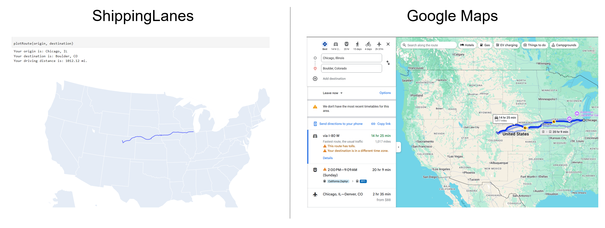

ShippingLanes is an ultra-lightweight Python extension which can calculate driving routes on major US highway networks.

This tool is ideal for supply chain analysts and industrial engineers working within Python environments, offering a fast, accurate alternative to premium mapping services.

Documentation can be found here: https://shippinglanes.readthedocs.io/en/latest/
