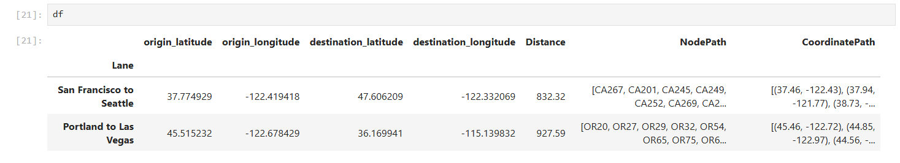

Finding Routes
==============

This page describes how to use the `findRoutes` method in **ShippingLanes** to generate and work with route data, including definitions, expected inputs, and how to handle returned data.

What is a Route?
----------------

A **Route** object represents a path generated by **ShippingLanes** and contains three ways to parse a specific driving route.

- **Distance**: The driving distance of the route in miles.
- **NodePath**: A list of node identifiers marking the sequence of points along the route.
- **CoordinatePath**: A list of latitude and longitude pairs (as tuples) that represent the path in geographic coordinates.

Input Data
----------

The `findRoutes` method expects the input data to be formatted as a list of lists, where each inner list contains four values: origin latitude, origin longitude, destination latitude, and destination longitude. If your coordinate data is stored in a Pandas DataFrame, you can convert it to the required format using `df.values.tolist()`:

.. code-block:: python

   from ShippingLanes import findRoutes
   import pandas as pd

   df = pd.DataFrame({
       "Lane" : ["San Francisco to Seattle", "Portland to Las Vegas"],
       "origin_latitude": [37.774929, 45.515232],
       "origin_longitude": [-122.419418, -122.678429],
       "destination_latitude": [47.606209, 36.169941],
       "destination_longitude": [-122.332069, -115.139832]
      }).set_index("Lane")
   
   # Convert to list of lists format
   coordinates = df.values.tolist()

Returned Routes
---------------

The routes returned by `findRoutes` can be directly incorporated back into your original DataFrame. Here’s an example:

.. code-block:: python

   routes = findRoutes(coordinates)
   
   df["Distance"] = [route.Distance for route in routes]
   df["NodePath"] = [route.NodePath for route in routes]
   df["CoordinatePath"] = [route.CoordinatePath for route in routes]

The output dataframe should look as follows:

Continue to the next section: :doc:`Practical Applications <practicalapplications>`
