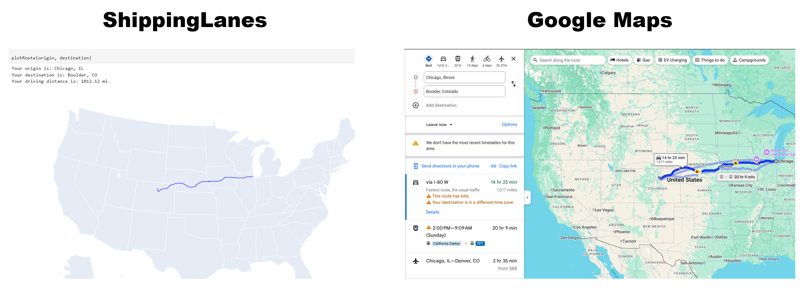
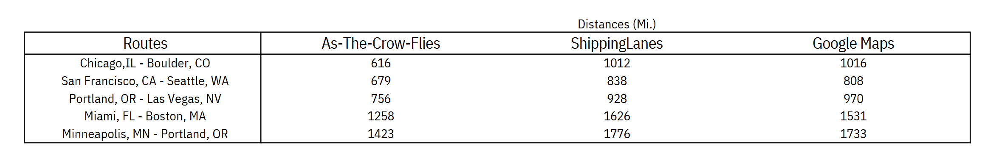

ShippingLanes
===================================

**ShippingLanes** is an ultra-lightweight Python extension which can calculate driving routes on major US highway networks. 

This tool is ideal for supply chain analysts and industrial engineers working within Python environments, offering a fast, accurate alternative to premium mapping services.

ShippingLanes is benchmarked against providers like Google Maps, aiming to match calculated driving distances within 5% of actual values. It performs particularly well on long routes with low radii of curvature, closely aligning with benchmark distances.

With a performance benchmark of just 2ms per route calculation, ShippingLanes strikes a balance between basic "as-the-crow-flies" analysis and high-end transportation optimization software. This makes it ideal for users needing custom or specialized analysis on large volumes of shipping data.

To get started, head to the :doc:`gettingstarted` section for core functionality.

Contents
--------

.. toctree::
   gettingstarted
   findingroutes
   practicalapplications

