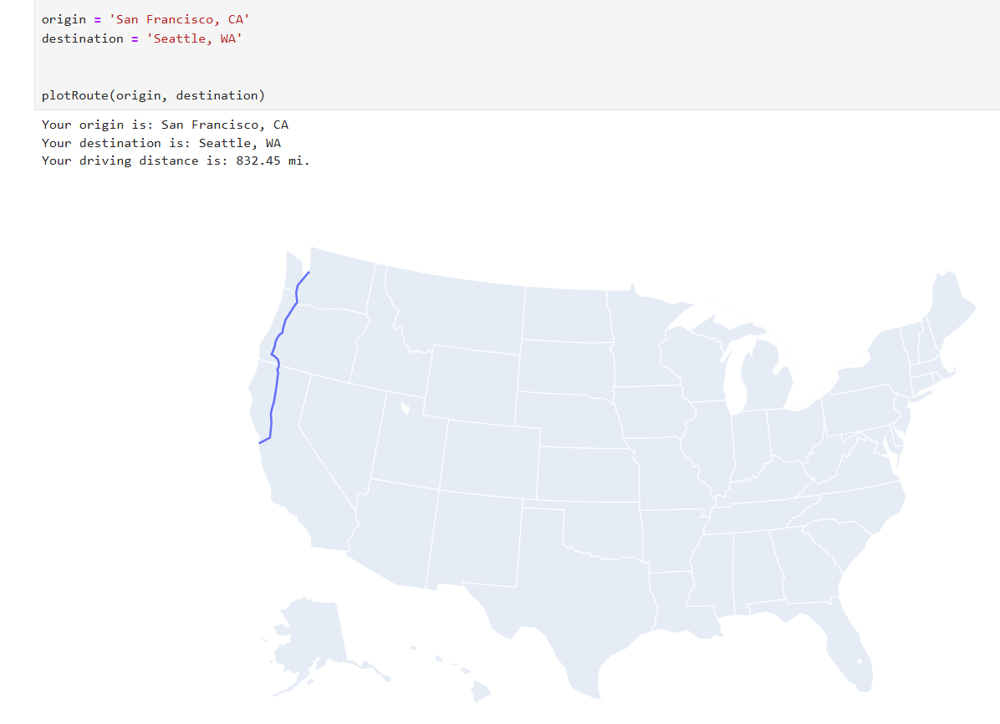
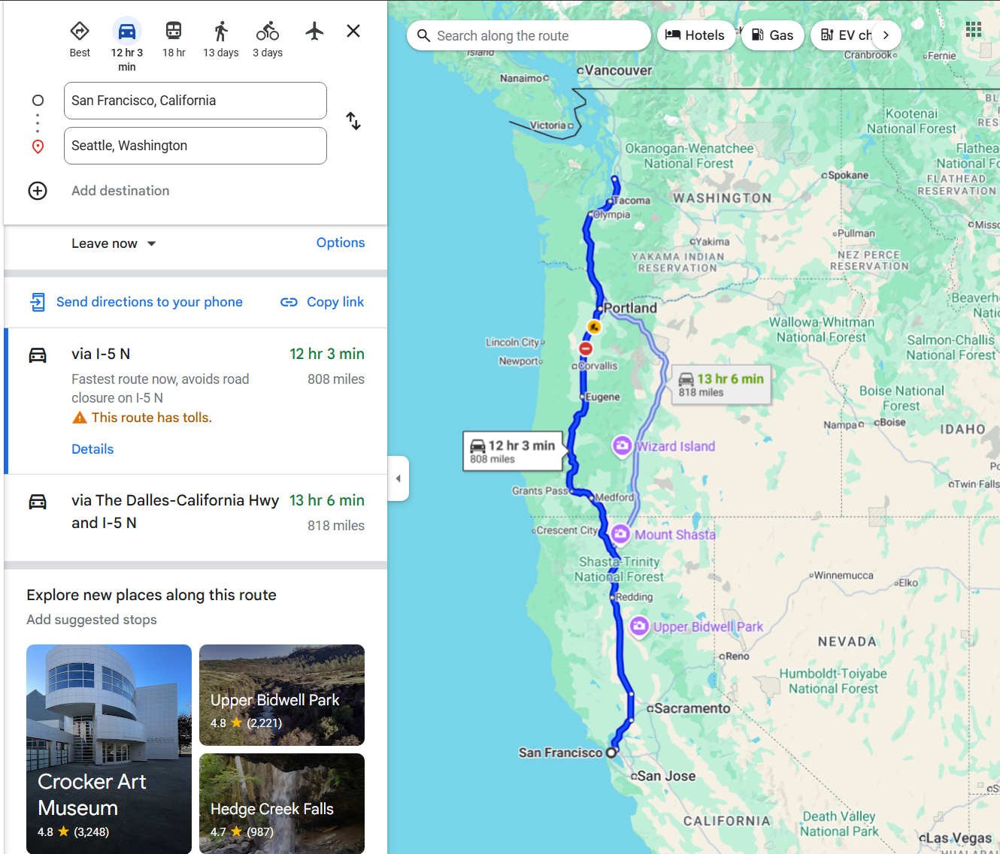
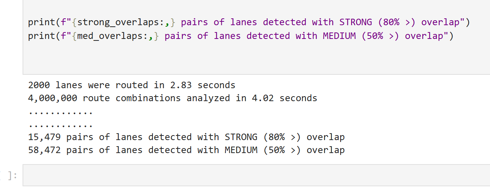

Practical Applications
======================

This section demonstrates a few ways that ShippingLanes ``Route`` objects can be used in supply chain analysis.

Plotting Routes with CoordinatePaths
----------------

The primary purpose of the ``CoordinatePath`` attribute is to visualize routes. There are many modules that can help with this endeavor - this tutorial will use ``plotly.express`` for simplicity.

To allow for free-form text input, we can leverage ``GeoPy`` and its geoencoding service as as an optional step. We will define a function that converts origin and destination as text inputs into a list of list format of coordinates as expected by ``findRoutes``.  

.. code-block:: python

   from ShippingLanes import findRoutes
   from geopy.geocoders import Nominatim
   import plotly.express as px
   import pandas as pd
   
   geolocator = Nominatim(user_agent="TestApp")
   
   def GetCoords(origin, destination):
       origin = geolocator.geocode(origin)
       destination = geolocator.geocode(destination)
       return [[origin.latitude, origin.longitude, destination.latitude, destination.longitude]]
   
   
   def plotRoute(origin, destination):
       
       coordinates = GetCoords(origin,destination)
       route = findRoutes(coordinates)[0]
       coordinatePath = route.CoordinatePath
       distance = route.Distance
       
       df = pd.DataFrame(coordinatePath, columns=["lat", "lon"])
   
       # Create the route plot
       fig = px.line_geo(df, lat="lat", lon="lon", projection="albers usa")
       
       # Customize layout
       fig.update_layout(
           title="",
           height=600
       )
   
       print(f"Your origin is: {origin}")
       print(f"Your destination is: {destination}")
       print(f"Your driving distance is: {distance:.2f} mi.")
       fig.show()
       return None
   
   
   origin = 'San Francisco, CA'
   destination = 'Seattle, WA'
   
   plotRoute(origin, destination)

This will generate the following plot:

We can compare this against a premium mapping service like Google maps:

Identifying Synergies with NodePaths
--------------------------
One of the purposes of the ``NodePaths`` attribute is to give analysts and engineers a way to "index" transportation behavior. The ShippingLanes highway network only includes major motorways and trunks. As such, for routes of sufficient distance, there is a higher likelihood of similar routes appearing on similar network segments.

As such, we can quickly compare and contrast large volumes of data by simply looking at the intersections between NodePaths - the most similar routes will have a greater number of nodes in common. 

This can be used for identifying backhaul opportunities (routes that allow a truck to return with a full load) and interhaul opportunities (routes that are "on the way" as other routes). 

To demonstrate the performance of the findRoutes library, we will generate 2000 random lanes based on a bounding box set within the continental united states. Then, we will search for routes that have strong overlaps (80% of nodes in common) and medium overlaps (50% of nodes in common).

.. code-block:: python

   from ShippingLanes import findRoutes
   import random
   import time
   from itertools import combinations
   
   
   def generateCoordinates(n=1):
       lat_min, lat_max = 24.396308, 49.384358
       lon_min, lon_max = -125.0, -66.93457
       
       coordinates = []
       for _ in range(n):
           origin_lat = random.uniform(lat_min, lat_max)
           origin_lon = random.uniform(lon_min, lon_max)
           dest_lat = random.uniform(lat_min, lat_max)
           dest_lon = random.uniform(lon_min, lon_max)
           coordinates.append([origin_lat, origin_lon, dest_lat, dest_lon])
       
       return coordinates
   
   def laneSimilarity(list1, list2):
       intersection = set(list1).intersection(list2)
       similarity = (len(intersection) / min(len(list1), len(list2))) * 100
       return similarity
   
   def countSimilarLanes(lists, threshold=80):
       count = 0
       for list1, list2 in combinations(lists, 2):
           if laneSimilarity(list1, list2) >= threshold:
               count += 1
       return count
   
   
   n = 2000
   coordinates = generateCoordinates(n)
   start_time = time.time()
   routes = findRoutes(coordinates)
   nodePaths = [i.NodePath for i in routes]
   routed_time = time.time() - start_time
   print(f"{n} lanes were routed in {routed_time:.2f} seconds")
   
   
   start_time = time.time()
   strong_overlaps = countSimilarLanes(nodePaths, threshold=80)
   compare_time = time.time() - start_time
   print(f"{n**2:,} route combinations analyzed in {compare_time:.2f} seconds")
   
   med_overlaps = countSimilarLanes(nodePaths, threshold=50)
   
   
   print("............")
   print("............")
   
   print(f"{strong_overlaps:,} pairs of lanes detected with STRONG (80% >) overlap")
   print(f"{med_overlaps:,} pairs of lanes detected with MEDIUM (50% >) overlap")

Running the above code produces the following output:

